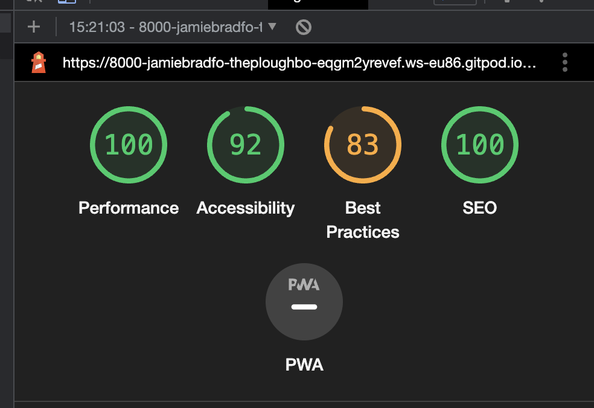

# The Plough Pub

The Plough Website is designed to be a responsive website on a range of devices such as a mobile and laptop. This site allows visitors to find out more information about The Plough
Pub and let them make a reservation if they wish. I build this website as this is a local business I attend reguarlly, but they lack an online presence. With this website it should
allow people to find out more about the business and make a reservation, as many people do not visit places without the guarentee of a seat.

## Link to Live site here:
https://the-plough.herokuapp.com/event

---

## CONTENTS

* [User Experience](#user-experience-ux)
  * [User Stories](#user-stories)

* [Design](#design)
  * [Colour Scheme](#colour-scheme)
  * [Typography](#typography)
  * [Imagery](#imagery)
  * [Wireframes](#wireframes)

* [Features](#features)
  * [General Features on Each Page](#general-features-on-each-page)
  * [Future Implementations](#future-implementations)
  * [Accessibility](#accessibility)

* [Technologies Used](#technologies-used)
  * [Languages Used](#languages-used)
  * [Frameworks, Libraries & Programs Used](#frameworks-libraries--programs-used)

* [Deployment & Local Development](#deployment--local-development)
  * [Deployment](#deployment)
  * [Local Development](#local-development)
    * [How to Fork](#how-to-fork)
    * [How to Clone](#how-to-clone)

* [Testing](#testing)

* [Credits](#credits)
  * [Code Used](#code-used)
  * [Content](#content)
  * [Media](#media)
  * [Acknowledgments](#acknowledgments)

---

## User Experience (UX)

The Plough website allows users to do multiple things, such as make, edit or cancel a reservation. Users will also be able to view, like and comment on events that will be occuring at the pub. 

Having an online presence will help boost this businesses returns, as it will reach a wider audience who will be able to see what food, drink and events the Plough offers. First time users and especially those that have never visited the establishment may discover something that interests them and encourage them to book and visit the Pub. Returning members can keep visiting to see the latest events and edit/cancel or make another booking. 

# Client goals
- To recieve bookings from customers 
- To be able to accept, edit and cancel bookings
- To be able to display the pubs menu's to viewers
- To be able to add, edit and delete events

# First time visitor goals
- To be able to gain more information about the pub (address, contact information etc)
- To be able to make a booking for the pub
- To be able to view the latest events happening at the pub

# Returning visitor goals
- See the latest events 
- To book a table again

## Design

### Colour Scheme

I decided to go for darker greys and white color scheme, as it matches the images I would be using. It also gives a more classier feel which matches the pub itself, and I want users to feel this is a fancy establishement.

### Typography

4 fonts where used in the making of this project, Lato, Playfair Display, Roboto Slab and Montserrat.

Playfair display was used as it most reflected the real world logo of The Plough. As for the other fonts, I ensured they matched the style of the website and they are clear and easy to read. Roboto Slab was used on the main page as it is bolder and larger, which will draw attention to it

### Imagery

The images used on this site are meant to be images of the pub itself. As this is an example project, real images are not available, therefore images that closely reflect the Plough pub have been used. On the menu page, the images used are to show some of the products related to said menu that the Plough sell. 

### Wireframes

Mobile view

Booking page

Events page

Home page

Menu Page

## Features

This website has several pages and some of these are viewable or appear differently depending on a) the user is logged in or b)if the user is logged in as a customer or c) the user is signed in as an admin/ member of staff. 

All pages use the base html, which contains a responsive navigation bar allowing users to get around the site. The Plough Logi is always on the top right, and also acts as a button to take the users back to the home page. If the user is not signed in, the nav bar contains a "Register" and a "Log In" button. If a customer is signed in, this will change to just a "Log out" button. If an admin/ staff member is logged in, an additional "Staff" button will appear on the nav bar which will take them to the staff home page. 

All pages also contain the same footer, which has all the contact information of the pub, as well as the address and the social media links. 

# Home Page
- Large masthead with a background image of the Plough with a button which can take users straight to the booking page
- 3 cards underneath each with relevant images to what they are related to
  - Reservation card
  - Menu's card
  - Book now card

# Menu page
- Contains 3 cards that the users can click on to see the different menus. A breakfast menu, a main menu and a drinks menu

# Events page
- As a customer user or a user that has not logged in, this page shows all the different events that will be happening at the Plough. Each event has a relevant image, date, time, information and the price. 

- If logged in as an admin, a button at the top of the page will be visable allowing the user to add an event. Clicking this button takes the user to the add events page, where the user can fill out the form. 

# Booking page
- Allows users to make a reservation. This page contains a form which users can fill out, and the restaurant can approve, edit or delete these bookings. The restaurant will email the customer to comfirm their booking. 
- Only users that are logged in can access this page, if they are not logged in, they will be asked to log in. 

# Staff page
- Only accessable to staff users. This page allows the user to see all bookings, ordered by date. Here, users can edit, approve and delete bookings.

### Future Implementations

- Fuctionality for users to view their own bookings, edit and cancel them
- Email functionality for booking confirmations to be sent automatically when approved, or when changes have been made
- Automatically approve bookings, and decline when certain criteria has been made such as duplicate booking, or too many bookings on the same day/time. 
- Forgot password and change password functionality
- Allow social media log in 
- Allow admin to edit users, delete users, create new staff users
- Automatic testing

### Accessibility

- Used semantic HTML
- Distinct color differences so all text is easy to read
- Using descriptive alt attributes on images on the site.
- Providing information for screen readers where there are icons used and no text 

## Technologies Used

- HTML5 - Provides the content and structure for the website.
- CSS - Provides the styling for the website.
- Django - A model-view-template framework used to create The Plough
- Bootstrap - Used to style the front end
- JavaScript - Creates the interactive aspects of the website
- Python - Provides the functionality of the website.
- Compressor - Used to compress the images.
- Am I Responsive? - To show the website image on a range of devices.
- GitHub - Used to host and deploy the website.
- Gitpod - Used to create the code for the site
- Google Chrome DevTools - Used to test responsiveness and debug.
- Balsamiq - Used to create the wire-frame.
- Cloudinary - Used to host all static files .
- Heroku - Used to deploy the website
- Google Fonts - To import the fonts used on the website.
- Font Awesome - For the iconography on the website.
- PEP8 Validation - Used to validate Python code
- HTML Validation - Used to validate HTML code
- CSS Validation - Used to validate CSS code
- JSHint Validation - Used to validate JavaScript code

## Testing

- HTML
    - No errors were returned when passing through the official [W3C validator](https://validator.w3.org/nu/?doc=https%3A%2F%2Fjamiebradford123.github.io%2FThe-Plough-Booking%2F)
    
- CSS
    - No errors were found when passing through the official [(Jigsaw) validator](/media/images/jigsaw-css.png)
- JavaScript
    - No errors were found when passing through the official [Jshint validator]()
      - The following metrics were returned: 
      - There are 7 functions in this file.
      - Function with the largest signature take 1 arguments, while the median is 1.
      - Largest function has 12 statements in it, while the median is 2.
      - The most complex function has a cyclomatic complexity value of 4 while the median is 1.

# Testing user stories

# Lighthouse testing
Home Page

Menu Page

Events Page

Booking Page

Staff Page

# Manual Testing

## Credits

- Readme template - https://github.com/kera-cudmore/Bully-Book-Club#bully-book-club-website
- CI Tutorial projects - Hello Django and I Think I Blog for inspiration and a basis to build on 

### Code Used

If you have used some code in your project that you didn't write, this is the place to make note of it. Credit the author of the code and if possible a link to where you found the code. You could also add in a brief description of what the code does, or what you are using it for here.

### Content

Who wrote the content for the website? Was it yourself - or have you made the site for someone and they specified what the site was to say? This is the best place to put this information.

###  Media

If you have used any media on your site (images, audio, video etc) you can credit them here. I like to link back to the source where I found the media, and include where on the site the image is used.
  
###  Acknowledgments

If someone helped you out during your project, you can acknowledge them here! For example someone may have taken the time to help you on slack with a problem. Pop a little thank you here with a note of what they helped you with (I like to try and link back to their GitHub or Linked In account too). This is also a great place to thank your mentor and tutor support if you used them.